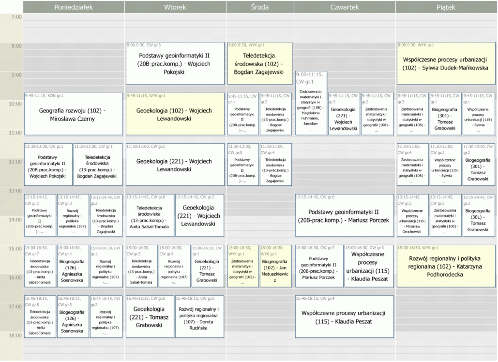

# Strona pozwalająca na dostosowanie planu z systemu Usos

Alternatywny temat projektu indywidualnego.  

Celem aplikacji jest wizualizacja planu studiów w zależności od grup na podstawie planu modelowego z serwisu Usos.

## Opis problemu

Na niektórych uczelniach studenci sami organizują swój plan zamiast być przydzielenie do konkretnych grup, jak to ma miejsce na Politechnice Warszawskiej. Największą uczelnią stosującą tego typu rozwiązanie jest Uniwersytet Warszawski.

Podejście to umożliwia dużą swobodę w organizacji czasu studenta ale wymaga dobrego zaplanowania przynależności do grup ćwiczeniowych i laboratoryjnych.  
Student musi samodzielnie zadbać między innymi o to by zajęcia, na które się zapisze się nie pokrywały.

### Przykładowy plan

  
Plan można też zobaczyć pod [linkiem](https://usosweb.uw.edu.pl/kontroler.php?_action=katalog2/przedmioty/pokazPlanGrupyPrzedmiotow&grupa_kod=1900-1GF21&cdyd_kod=2019Z&plan_showSettings=1&plan_showStartTime=1&plan_showEndTime=1&plan_showTypeShort=1&plan_showTypeFull=0&plan_showGroupNumber=1&plan_showCourseName=1&plan_showCourseCode=0&plan_showRoom=1&plan_showBuildingCode=1&plan_showLecturers=1&plan_overridePrintWidth=1&plan_format=gif&plan_colorScheme=default)

Jak widać plan jest nieczytelny z powodu natłoku informacji o wszystkich grupach. System Usos nie umożliwia łatwej wizualizacji wybrana poszczególnych grup na wybrana zajęcia.

## Rozwiązanie problemu

Celem projektu byłoby napisanie aplikacji umożliwiającej wizualizację zapisu studenta do poszczególnych grup co ułatwiło by planowanie semestru studentom. Jest to realny problem, który nie został jeszcze rozwiązany. Gotowa aplikacja mogłaby być realną pomocą dla studentów Uniwersytetu Warszawskiego.

Produktem końcowym byłaby aplikacja webowa napisana w C# MVC, do której użytkowniku mógłby wpisać odnośnik do swojego planu. Aplikacja pobrałaby odpowiednie dane z systemu Usos a następnie przedstawiła użytkownikowi interaktywny widok pozwalający na dostosowanie planu zgodnie z możliwymi grupami przedmiotowymi.

## Dodatkowe funkcjonalności

* Dostępność aplikacji w Internecie przy pomocy publikacji w chmurze Azure
* Zapis ustawień i preferencji użytkownika do bazy i możliwość ponownego wczytania edytowanego planu
* System kont użytkowników i logowania
* Proponowane ustawienie planu pod kontem np. minimalizacji "okienek"